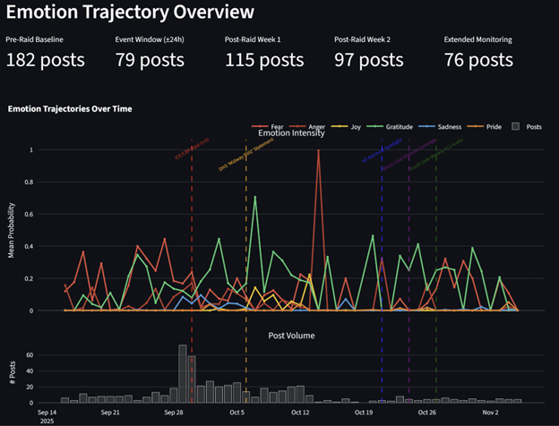
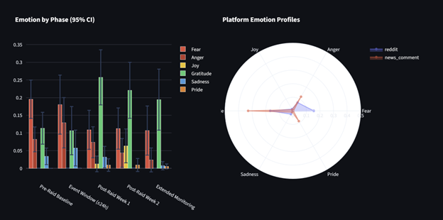
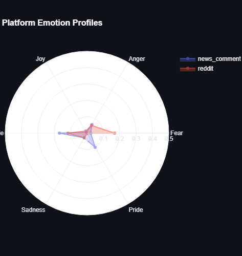
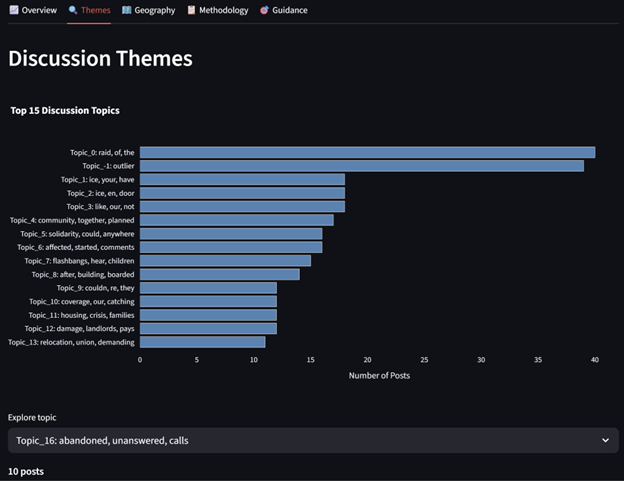
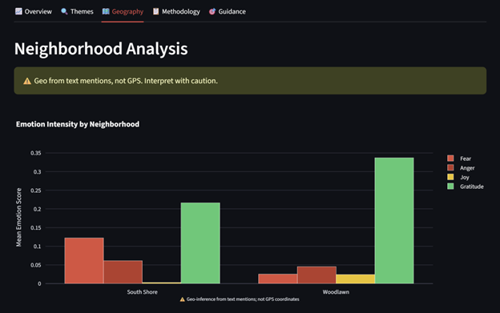
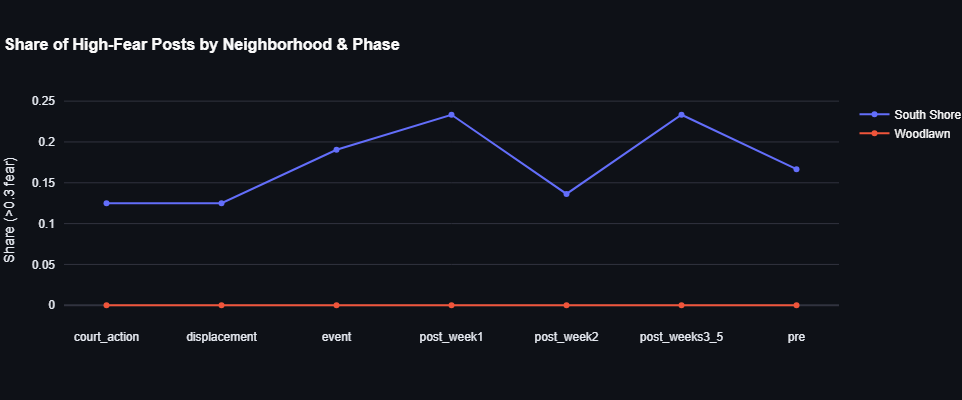
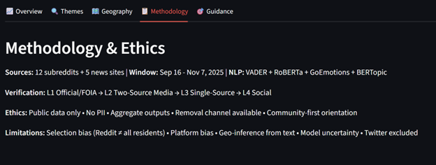
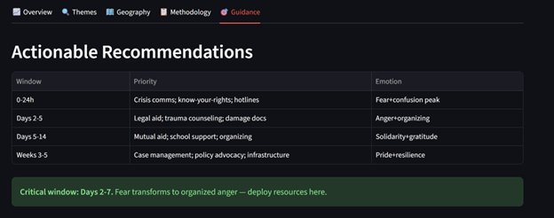

# 🏘️ South Shore Sentiment Study — ICE Raid Aftermath Analysis (2025)

[](https://python.org)
[](LICENSE)
[](https://streamlit.io)
[](https://duckdb.org)

> **Measuring how public sentiment in South Shore and adjacent Chicago neighborhoods evolved before and after the September 30, 2025 ICE/CBP raid — mapping emotional trajectories from fear → anger → solidarity → resilience → displacement.**

---

## 📋 Table of Contents

- [Project Overview](#-project-overview)
- [Real-World Context](#-real-world-context)
- [Architecture](#-architecture)
- [Folder Structure](#-folder-structure)
- [Setup & Installation](#-setup--installation)
- [Pipeline Execution](#-pipeline-execution)
- [Data Sources](#-data-sources)
- [Methodology](#-methodology)
- [Dashboard](#-dashboard)
- [Dashboard Preview](#-dashboard-preview)
- [Ethics & Governance](#-ethics--governance)
- [Results](#-results)
- [Contributing](#-contributing)

---

## 🎯 Project Overview

**Anchor Event:** Operation Midway Blitz — ICE/CBP/FBI/ATF enforcement action at 7500 S. South Shore Drive, Chicago — September 30, 2025 (t=0)

**Analysis Window:** Sep 16 – Dec 12, 2025 (73 days, from pre-raid baseline through forced displacement)

**Objective:** Produce actionable timing guidance for community outreach and services by tracking emotional arcs across 7 temporal phases, grounded in verified investigative journalism from Block Club Chicago.

### Key Deliverables
| Deliverable | Description |
|-------------|-------------|
| **Sentiment Pipeline** | End-to-end NLP pipeline: ingestion → cleaning → emotion tagging → topic modeling |
| **Longitudinal Analysis** | Emotion-over-time curves with bootstrapped CIs across 7 phases |
| **Verified Event Timeline** | 14 journalist-verified events from Block Club Chicago investigative reporting |
| **Interactive Dashboard** | Streamlit app with Overview, Themes, Geography, Timeline, Methodology, Guidance tabs |
| **Program Guidance** | Timing recommendations for crisis comms, legal aid, mutual aid, displacement support |
| **Public Report** | PDF with executive summary, verified context, and limitations |

---

## 📰 Real-World Context

This project analyzes public sentiment surrounding a real and significant enforcement event. The emotional trajectories detected in social media discourse are grounded in verified investigative reporting by [Block Club Chicago](https://blockclubchicago.org/), an independent, nonprofit newsroom covering Chicago's neighborhoods.

### Verified Event Timeline

| Date | Event | Source |
|------|-------|--------|
| **Sep 30, 2025** | **Operation Midway Blitz** — Hundreds of federal agents (CBP/FBI/ATF/ICE) raid 7500 S. South Shore Dr at 2 AM. Helicopters, flashbangs, 37+ arrested. | [Block Club Chicago](https://blockclubchicago.org/2025/09/30/armed-agents-in-unmarked-vans-target-south-shore-apartment-building/) |
| Oct 1, 2025 | Residents return to ransacked apartments — broken doors, stolen belongings, blood stains, zip ties on floors | [Block Club Chicago](https://blockclubchicago.org/2025/10/02/south-shore-residents-return-to-ransacked-apartments-try-to-move-out-after-ice-raid-it-looks-like-hell/) |
| Oct 24, 2025 | Investigation reveals building averaged 1+ emergency calls/day for 5 years pre-raid | [Block Club Chicago](https://blockclubchicago.org/2025/10/24/south-shore-residents-made-thousands-of-distress-calls-to-city-before-massive-federal-raid/) |
| Nov 7, 2025 | Judge orders building cleared, appoints receiver; owner loses control | [Block Club Chicago](https://blockclubchicago.org/2025/11/07/all-residents-to-leave-as-court-takes-control-of-south-shore-building-raided-by-feds/) |
| Nov 24, 2025 | ~30 remaining tenants form union demanding relocation assistance | [Block Club Chicago](https://blockclubchicago.org/2025/11/24/raided-south-shore-buildings-remaining-tenants-say-they-havent-received-court-ordered-help/) |
| Dec 8, 2025 | Judge denies extension, sets Dec 12 eviction deadline | [Block Club Chicago](https://blockclubchicago.org/2025/12/08/raided-south-shore-building-to-be-cleared-friday-after-judge-denies-residents-motion-for-more-time/) |
| Dec 12, 2025 | Building vacated — all residents leave by court-ordered deadline | Block Club Chicago |
| Jan 22, 2026 | State opens investigation into landlord tipping off federal agents | [Block Club Chicago](https://blockclubchicago.org/2026/01/22/did-landlord-tip-off-immigration-raid-at-troubled-south-shore-building-the-state-is-investigating/) |

> **Note:** Block Club Chicago's `robots.txt` blocks automated scraping. These articles are cited as verified context sources, not scraped for content. Reddit discussions *about* these articles are collected through standard ingestion pipelines.

Full verified timeline with 14 events: [`config/verified_events.yaml`](config/verified_events.yaml)

---

## 🏗️ Architecture

```
┌─────────────────────────────────────────────────────────────┐
│                     DATA SOURCES                            │
│  Reddit (PRAW-free)  │  News Comments (BS4)  │  Synthetic  │
└──────────┬───────────┴──────────┬────────────┴──────┬──────┘
           │                      │                    │
           ▼                      ▼                    ▼
┌─────────────────────────────────────────────────────────────┐
│                   INGESTION LAYER                           │
│  PullPush.io API  │  BeautifulSoup  │  Synthetic Generator  │
│  Old Reddit JSON  │  Newspaper3k    │  Faker + Templates    │
└──────────┬───────────────────────┬───────────────────┬──────┘
           │                       │                    │
           ▼                       ▼                    ▼
┌─────────────────────────────────────────────────────────────┐
│               STORAGE (DuckDB) + Verified Events            │
│  posts_raw │ posts_clean │ posts_emotions │ topics │ events │
└──────────┬──────────────────┬────────────────────────┬──────┘
           │                  │                         │
           ▼                  ▼                         ▼
┌─────────────────────────────────────────────────────────────┐
│                  ANALYSIS ENGINE                            │
│  VADER + RoBERTa  │  GoEmotions  │  BERTopic  │  spaCy NER │
└──────────┬──────────────────┬────────────────────────┬──────┘
           │                  │                         │
           ▼                  ▼                         ▼
┌─────────────────────────────────────────────────────────────┐
│               VISUALIZATION & OUTPUT                        │
│  Plotly Curves  │  Streamlit Dashboard  │  PDF Report       │
└─────────────────────────────────────────────────────────────┘
```

---

## 📁 Folder Structure

```
south-shore-sentiment-study/
├── .github/
│   └── workflows/
├── config/
├── data/
│   ├── raw/                          # Immutable ingested data
│   ├── processed/                    # Cleaned + enriched parquets
│   ├── synthetic/                    # Generated synthetic fallback data
│   └── exports/                     
├── docs/
│   ├── ETHICS.md                     # Ethical use statement
│   ├── METHODOLOGY.md                # Full methodology writeup
│   ├── LIMITATIONS.md                # Known limitations
│   ├── screenshots/                  # Dashboard screenshots
│   └── report/                 
├── src/
│   ├── ingestion/
│   ├── analysis/
│   ├── visualization/
│   └── utils/
├── dashboards/
├── tests/
├── notebooks/
├── Makefile                          # Task runner
├── pyproject.toml                    # Modern Python packaging
├── requirements.txt                  # Pinned dependencies
├── LICENSE
└── README.md

```

---

## 🚀 Setup & Installation

### Prerequisites
- Python 3.10+
- 8GB+ RAM (for transformer models)

### Quick Start

```bash
# Clone
git clone https://github.com/YOUR_USERNAME/south-shore-sentiment-study.git
cd south-shore-sentiment-study

# Environment
cp config/.env.example .env
python -m venv .venv && source .venv/bin/activate

# Install
pip install -r requirements.txt
python -m spacy download en_core_web_sm

# Initialize database
make init-db

# Run full pipeline
make run-all
```

### Make Commands

```bash
make ingest          # Collect data from all sources
make ingest-synthetic # Generate synthetic fallback data
make clean-data      # Run text cleaning pipeline
make analyze         # Run sentiment + emotion + topic analysis
make dashboard       # Launch Streamlit dashboard
make report          # Generate PDF report
make run-all         # Execute full pipeline end-to-end
make test            # Run test suite
make lint            # Code quality checks
```

---

## 📊 Data Sources

### Reddit (No Official API Required)
Since Reddit's official API access was denied, we use **fully legal public-access alternatives**:

| Method | Endpoint | Rate Limit | Notes |
|--------|----------|------------|-------|
| **PullPush.io** | `api.pullpush.io/reddit/search` | Respectful pacing | Pushshift successor; public Reddit archive |
| **Old Reddit JSON** | `old.reddit.com/r/{sub}/.json` | 1 req/2s | Append `.json` to any Reddit URL |
| **Arctic Shift** | `arctic-shift.io` | Bulk dumps | Monthly Reddit data dumps |

### Target Subreddits
`r/Chicago`, `r/news`, `r/Illinois`, `r/AskChicago`, `r/50501Chicago`, `r/EyesOnIce`, `r/moderatepolitics`, `r/politics`, `r/ICE_Raids`, `r/WindyCity`, `r/AskConservatives`, `r/somethingiswrong2024`

### Verified Context Sources
Block Club Chicago, WBEZ, Chicago Sun-Times, South Side Weekly, AP News

> **Important:** Block Club Chicago articles are cited as **verified context sources** (not scraped). Their `robots.txt` blocks automated access. Reddit discussions *referencing* these articles are collected through standard pipelines.

---

## 🔬 Methodology

### Phase Definitions (Extended 7-Phase Model)
| Phase | Window | Description |
|-------|--------|-------------|
| `pre` | Sep 16–29 | Baseline sentiment before raid |
| `event` | Sep 30 ± 24h | Immediate reaction window |
| `post_week1` | Oct 1–7 | Early aftermath |
| `post_week2` | Oct 8–14 | Stabilization period |
| `post_weeks3_5` | Oct 15–Nov 7 | Extended monitoring |
| `court_action` | Nov 8–30 | Court action & tenants union formation |
| `displacement` | Dec 1–12 | Forced displacement & building vacancy |

### NLP Stack
- **VADER**: Polarity baseline (positive/negative/neutral/compound)
- **RoBERTa** (`cardiffnlp/twitter-roberta-base-sentiment-latest`): Fine-tuned social media sentiment
- **GoEmotions** (`monologg/bert-base-cased-goemotions-original`): 27-label emotion taxonomy → mapped to 8 target emotions
- **BERTopic**: Dynamic topic modeling with temporal tracking
- **spaCy**: NER and geo-mention extraction

### Verified Event Integration
The analysis overlays 14 journalist-verified events from Block Club Chicago's investigative reporting. This grounds sentiment trajectory shifts in documented real-world events, enabling causal inference about what triggered emotional transitions. See [`config/verified_events.yaml`](config/verified_events.yaml).

---

## 📈 Dashboard

The Streamlit dashboard includes:

1. **Overview** — Emotion trajectory curves with confidence intervals + verified event markers
2. **Themes** — BERTopic clusters with top terms and exemplar posts
3. **Geography** — Neighborhood-level sentiment heatmaps
4. **Timeline** — Interactive verified event timeline with Block Club Chicago sourcing
5. **Methodology** — Ethics statement, verification levels, limitations
6. **Program Guidance** — Actionable recommendations with timing for all 7 phases

## 📸 Dashboard Preview

### Home


### Overview — Emotion Trajectories




### Discussion Themes


### Geography



### Methodology & Ethics


### Program Guidance


---

## ⚖️ Ethics & Governance

- **Public data only** — No private messages, no login-required content
- **No PII** — Usernames stripped; no doxxing; no precise addresses
- **Aggregate outputs only** — Individual posts never published verbatim
- **Verification levels** — L1: Official/court records, L2: Multi-source journalism, L3: Single media, L4: Social media
- **Verified sourcing** — Event timeline grounded in Block Club Chicago investigative reporting
- **Removal channel** — Organizations can request data removal

See [docs/ETHICS.md](docs/ETHICS.md) for the full Ethical Use Statement.

---

## 📄 License

MIT License — See [LICENSE](LICENSE) for details.

---

**Built with ❤️ for Chicago's South Shore community**
